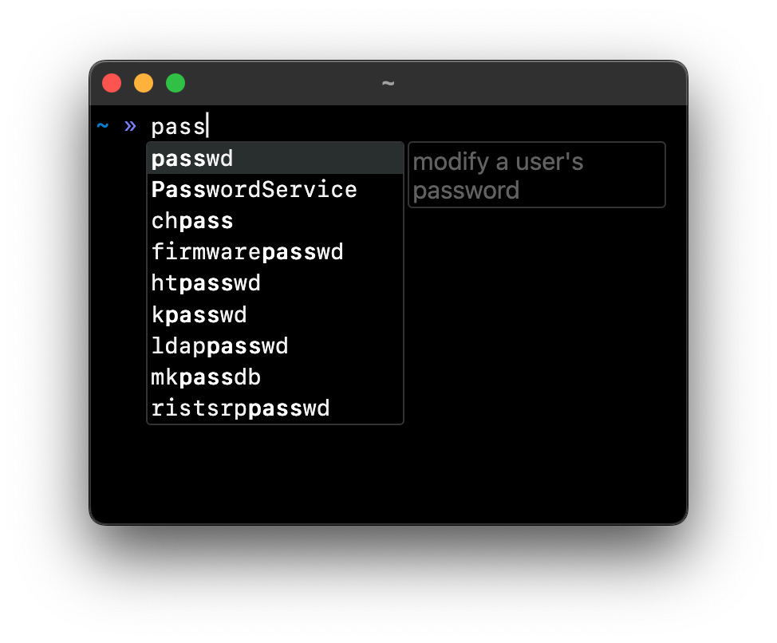
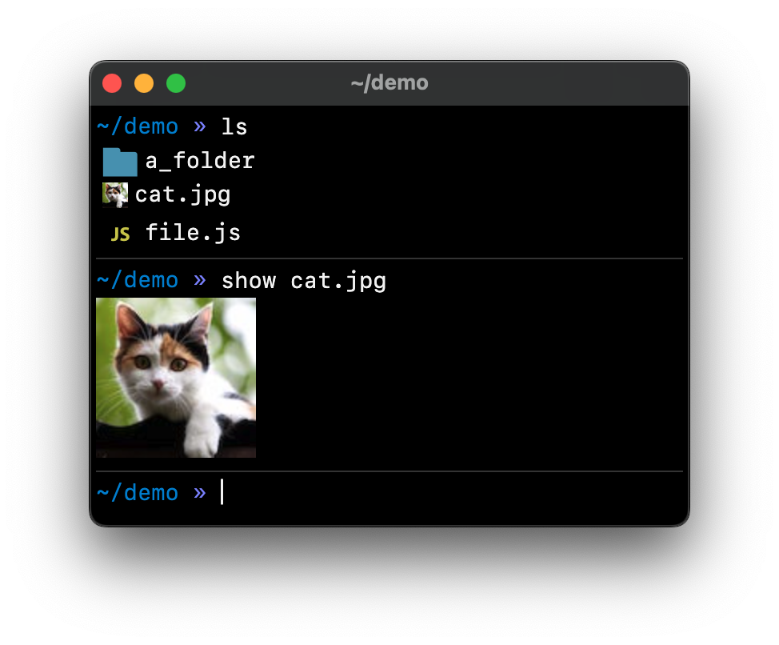
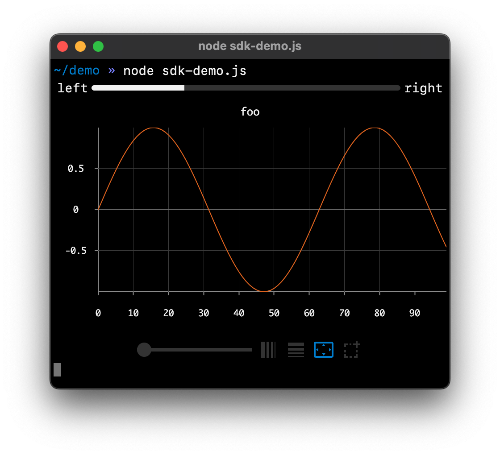
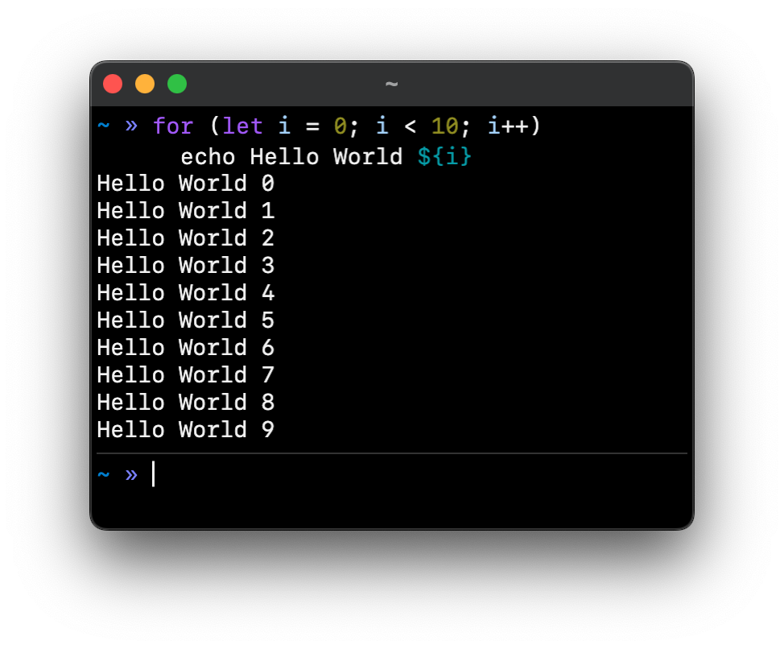
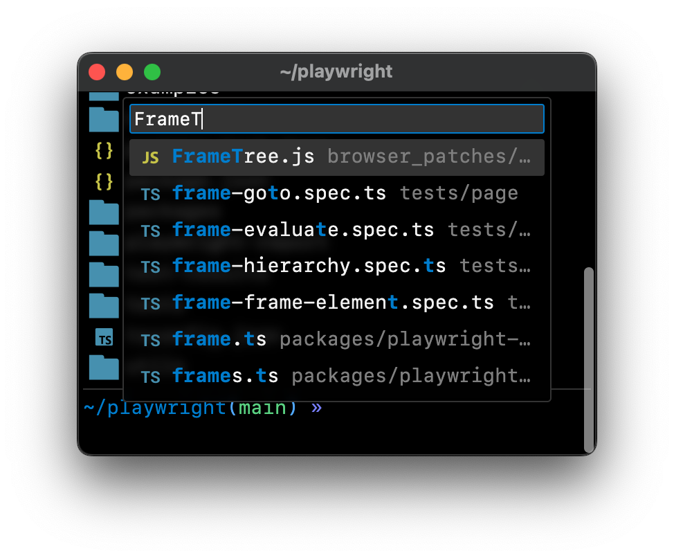
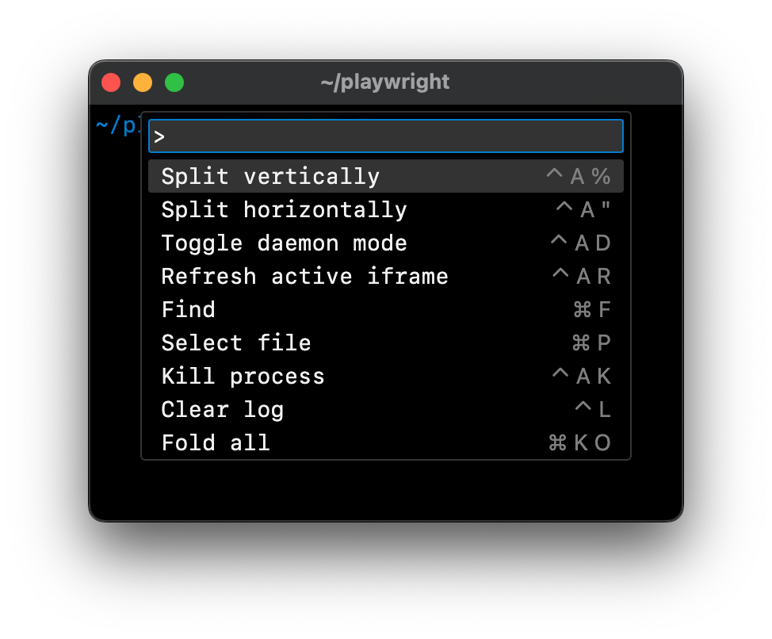
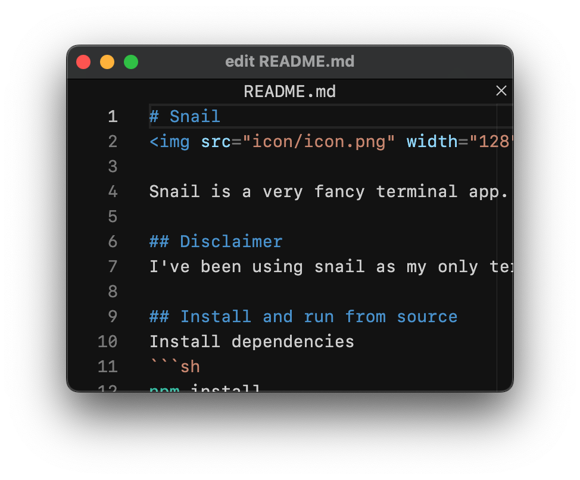

# Snail


Snail is a very fancy terminal

## Demo
Try out the live [halloween demo](https://joel.tools/halloween/)!

## Disclaimer
I've been using snail as my only terminal for over a year, but I would not recommend other people use it as part of their critical infrastructure yet. The apis might change before the 1.0 release and I can't garuantee it won't eat your data. That being said, I welcome feedback from the brave!

## Install and run from source
Install dependencies
```sh
npm install
```
Running snail
```sh
npm start
```

## Highlighted Features

### Autocomplete as you type
Snail completes files and folders and arguments for common commands. Just like in your IDE.



### Rich content
Snail can display everything from file icons and images to full web apps. Never be limited to just text.



### SDK
Progress bars, charts, and full interactive applications. Use the [Snail SDK](./sdk.md) to power your terminal applications.



### JavaScript + Shell
Snail has shell language which is a mix of JavaScript and shell. Because I can never remember how to write an if statement in bash.



### Fuzzy file finder
Use `⌘P` to search file names in the current directory or any subdirectory.



### Command menu
Use `⇧⌘P` to open the command menu. Terminal apps can also add their own actions into the menu.



### Text editing

Don't know how to quit vim? With `edit`, you get the full monaco text editor right in your terminal. And you can just click the x to close.



## Creating Rich Apps

```js
// backend.js
const { display } = require('snail-sdk');
display(require.resolve('./web.ts'));
```

```ts
// web.ts
import { setHeight } from 'snail-sdk/web';
document.body.append('Hello World!');
setHeight(document.body.offsetHeight);
```

```
> node backend.js
Hello World!
```
